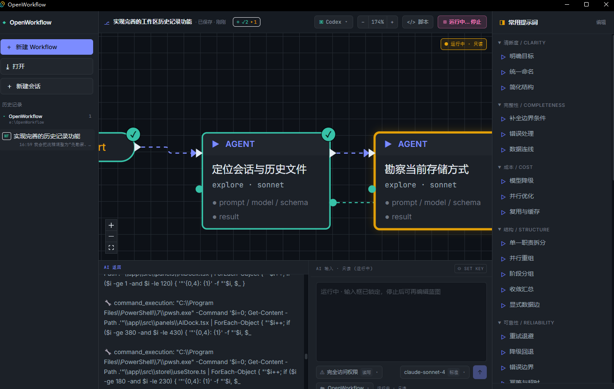

# Claude Code 有了 Workflow，那其他大模型怎么办？我最近发现了开源版 OpenWorkflow

最近一直在看 Claude Code 的 workflows。

它吸引我的地方不是“又多了一个功能”，而是它把复杂任务从一轮一轮聊天里抽了出来。任务可以拆成多个 subagents、并行分支和流水线，然后交给脚本去协调执行。

这件事挺关键：workflow 不再只是一次对话里的临时安排，而是可以保存、修改、重复使用的流程。

不过看完之后，我也有一个问题：如果 Workflow 会成为 AI 编程里很常用的一层，它为什么要绑在某一个模型或某一个 CLI 上？

顺着这个问题，我最近发现了一个开源版 OpenWorkflow。

它的思路很直接：把 Claude Code 这类 Workflow 做成可视化画布，并且让同一份 Workflow 可以面向 Claude Code、Codex、Gemini，甚至更多本地或云端模型运行时。



## 有哪些优点

先说我觉得比较有用的几个点。

- **支持多种大模型运行时**：同一份 workflow 不用为每个模型重写。Claude Code、Codex、Gemini 这些运行时都可以往这个方向接。
- **画布化编辑**：节点、连线、并行分支、流水线都能直接看到，比在脚本里来回找结构轻松很多。
- **节点可以单独改**：每个节点都能配置自己的 prompt、model、schema 和执行参数。简单节点用便宜模型，关键节点再用强模型。
- **常用提示词方便改 workflow**：右侧提示词库里有补边界、简化结构、模型降级、并行优化、降级回退这些常见改法，不用每次从空白 prompt 开始写。
- **支持临时调整节点**：调试时可以先停下来，只改失败节点的提示词、模型或输入，再继续处理，不必把整条流程推倒重来。
- **会话和工作区历史会保存**：试错时不容易丢上下文，也方便回到之前的 workflow 版本继续改。
- **运行状态比较直观**：哪个节点在跑、哪个节点完成、哪个节点失败，画布上能看到，比盯一长串日志更适合调 workflow。
- **密钥保存在本机**：API key 不需要交给远端服务，适合本地调试和浏览器侧的 AI 辅助编辑。
- **有统一 IR 和脚本视图**：画布背后不是纯 UI，它能生成 Claude Code 风格脚本，也给 Codex、Gemini 这类后续适配留了结构。

对我来说，最核心的还是前两点：workflow 不应该每换一个模型就重写一遍，也不应该只能藏在某个工具的脚本里。

比如一个代码审查流程，大概会有这些步骤：

- 先定位改动范围
- 再做风险分类
- 然后分别从质量、安全、兼容性几个角度看
- 最后汇总结果，必要时回退或重新跑某个节点

这套结构本身是有价值的。它不应该只是 Claude Code 脚本里的一段逻辑，也不应该因为换成 Codex 或 Gemini 就全部重来。

OpenWorkflow 的想法是，你先用自然语言把 workflow 需求说清楚，让它生成一张可编辑的蓝图。后面怎么优化、跑在哪个模型上，再慢慢调。

## 我第一次上手，是按这个顺序试的

如果只是想先摸一下这个工具，不用一上来研究所有概念。我当时是按下面这个顺序试的。

### 第一步：新建 Workflow，然后在右下角写需求

打开应用后，可以先新建一个 Workflow。

真正开始的地方不是手动画节点，而是右下角的 AI 输入框。

比如可以直接写：

```text
帮我生成一个代码审查 workflow：
先分析改动范围，再做风险分类，
然后并行检查代码质量、安全问题和兼容性，
最后汇总结果并验证有没有遗漏。
```

发送之后，OpenWorkflow 会根据这段需求自动生成 workflow 蓝图。画布上会出现节点、连线、并行分支或流水线结构。

配图占位：这里可以补一张“右下角 AI 输入需求后生成蓝图”的截图。

### 第二步：先看蓝图结构，不急着运行

生成出来以后，先看它拆得对不对。

我一般会先看几件事：

- 有没有把任务拆成合适的节点
- 哪些步骤应该串行，哪些步骤可以并行
- 有没有遗漏输入、输出、失败路径
- 汇总节点是不是放在并行分支之后
- 验证节点是不是在最后

这一步像是在看一张执行计划。先别急着跑，因为 workflow 的价值就在于可以先改结构。

### 第三步：继续在右下角输入，让它修改蓝图

如果蓝图不够好，可以继续在同一个 AI 输入框里追加要求。

比如：

```text
把安全检查再拆成三个节点：权限、路径处理、敏感信息。
```

或者：

```text
给每个可能失败的节点增加回退路径，简单分类节点尽量使用轻量模型。
```

这一步很重要。OpenWorkflow 不是只生成一次图就结束，而是可以通过连续输入来反复修改蓝图。

### 第四步：用右侧常用提示词继续优化

如果不知道下一步该怎么改，可以点右侧的常用提示词。

里面有这些方向：

- 明确目标
- 统一命名
- 简化结构
- 补全边界条件
- 错误处理
- 数据连线
- 模型降级
- 并行优化
- 复用与缓存
- 降级回退
- 错误边界

这些提示词不是拿来装饰的，点一下就相当于给 AI 输入了一条常见的 workflow 优化指令。

很多时候不是不知道要让 AI 做什么，而是不知道怎么把任务拆得更稳。右侧这些提示词相当于提醒你：这个 workflow 有没有失败路径？有没有边界条件？有没有不必要的昂贵模型？有没有可以并行的部分？

### 第五步：必要时再手工改节点

AI 生成和迭代之后，如果只是某个节点的小问题，可以直接选中节点，在右侧属性里改。

这里可以改：

- 节点名称
- prompt
- 模型档位
- schema
- 其他参数

这个设计比较实用，因为 workflow 不是一个大 prompt。每个节点都可以有自己的职责，也可以临时单独调整。

比如一个审查流程里：

- `定位改动范围` 可以用轻一点的模型
- `安全审查` 可以用更强的模型
- `汇总结果` 可以单独作为一个节点
- `验证遗漏` 可以再接一个 verifier 节点

这样比把所有要求塞进一个长 prompt 里更容易维护。

配图占位：这里可以补一张“选中节点后右侧属性面板”的截图。

### 第六步：选择运行时

蓝图差不多以后，再看顶部工具栏里的运行时适配器。

这里可以切换：

- Claude Code
- Codex
- Gemini

这就是 OpenWorkflow 比较核心的点。它不是把 workflow 直接绑死到某一个模型里，而是把运行时作为可以切换的目标。

配图占位：这里可以补一张“运行时下拉选择 Claude Code / Codex / Gemini”的截图。

### 第七步：点击顶部运行按钮，真正执行

蓝图调好以后，点顶部的运行按钮，才是真正执行 workflow。

运行时画布上会显示节点状态。哪个节点在跑，哪个节点完成，哪个节点失败，会比纯文本日志更直观。

如果一个大任务失败了，你不一定要整段 prompt 从头改。可以先看失败在哪个节点，停下来改这个节点的提示词、模型或数据输入，再继续处理。

配图占位：这里可以补一张“运行中节点状态”的截图。

### 第八步：看生成脚本，或者继续保存历史

顶部还有脚本入口，可以看到从画布生成的 Claude Code 风格 Workflow 脚本。

这一步能帮助你确认一件事：OpenWorkflow 不是单纯画图，它背后确实有 workflow 结构。

另外左侧也有会话和工作区历史。对经常试不同 workflow 的人来说，这比临时保存一堆 prompt 文本方便很多。

## 一个普通代码审查 workflow 可以怎么生成

拿“检查当前代码改动”举例，可以先在右下角 AI 输入框里写：

```text
帮我生成一个检查当前代码改动的 workflow。
流程包括：定位改动范围、风险分类、并行做质量审查、
安全审查和兼容性审查，最后汇总发现并验证遗漏。
```

生成出来的结构大概会像这样：

```text
Start
  -> 定位改动范围
  -> 风险分类
  -> 并行审查
      -> 质量审查
      -> 安全审查
      -> 兼容性审查
  -> 汇总
  -> 验证遗漏
  -> End
```

如果觉得还不够细，就继续输入：

```text
把安全审查拆成权限、路径、敏感信息三个节点；
把风险分类节点设置成轻量模型；
给汇总之后增加一个 verifier 节点。
```

这样它会继续改当前蓝图，而不是重新从空白开始。

每个节点的职责可以写得很短：

- `定位改动范围`：找出这次改动涉及的文件、模块和核心逻辑
- `风险分类`：判断改动属于 UI、状态、文件、网络、构建还是安全相关
- `质量审查`：看可读性、重复逻辑、边界处理
- `安全审查`：看权限、路径、敏感信息、命令执行
- `兼容性审查`：看平台差异、旧数据、配置变更
- `汇总`：把几个分支的结论合成一个列表
- `验证遗漏`：检查有没有未覆盖的关键路径

这套流程不应该只存在于某一次对话里。

它应该能保存下来。下次遇到类似任务，改几句话或者点几个常用提示词就能继续用。简单节点用便宜模型，复杂节点用强模型。某个节点失败了，也可以只调整这个节点，而不是整套流程重来。

这也是 workflow 有意思的地方。

## 并行和流水线怎么理解

如果一个任务里有几段互不依赖的检查，就可以让 AI 生成 parallel。

比如：

```text
把质量检查、安全检查、兼容性检查改成并行执行。
```

如果几步之间有明显前后依赖，就让它生成 pipeline。

比如：

```text
收集上下文 -> 生成修改方案 -> 执行修改 -> 验证结果
```

这里的重点不是节点看起来多漂亮，而是你能把任务拆成可解释、可替换、可重跑的结构。

配图占位：这里可以补一张“parallel 或 pipeline 节点”的截图。

## 和 Claude Code 是什么关系

OpenWorkflow 看起来不是要替代 Claude Code。

Claude Code 已经把 workflows 这个方向讲清楚了：复杂任务可以被写成动态脚本，可以协调很多 subagents，可以在后台跑。

OpenWorkflow 更像是在这个方向上补一个可视化层：

- Claude Code 擅长执行
- OpenWorkflow 负责把 workflow 画出来、改出来、保存下来
- 同一份 workflow 以后可以尝试接到更多模型和运行时

所以它不是反着来，而是顺着 Claude Code 的 Workflow 思路往外扩。

## 现在还早，但方向值得看

OpenWorkflow 现在还不算成熟。很多地方还在改，运行时适配也还要继续补。

但方向是清楚的：AI 编程不会长期停留在“开一个聊天框，然后手动推进每一步”。

复杂任务最后一定会变成 workflow。区别只是，这个 workflow 是锁在某个工具里，还是能被看见、编辑、迁移和复用。

OpenWorkflow 现在做的，就是把这件事往后者推。

如果你也在用 Claude Code workflows，或者你也在不同模型之间来回切，可以看看 OpenWorkflow。也可以去提 issue，尤其是你希望它优先支持哪些模型、CLI 或工作流格式。

项目地址：

https://github.com/wellingfeng/OpenWorkflow

参考：

https://code.claude.com/docs/en/workflows
